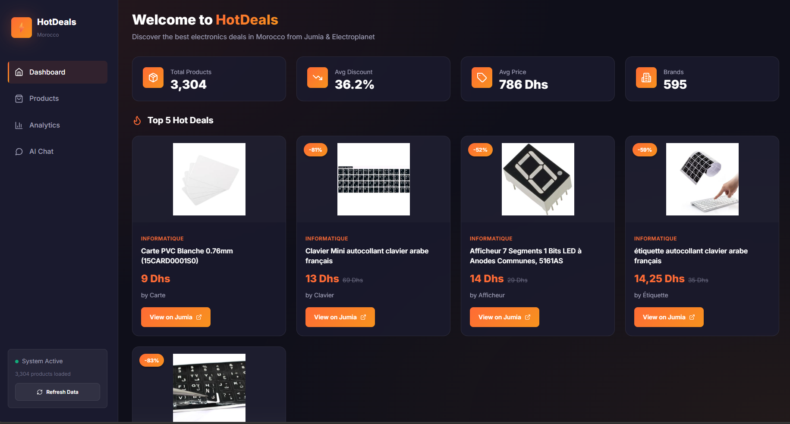
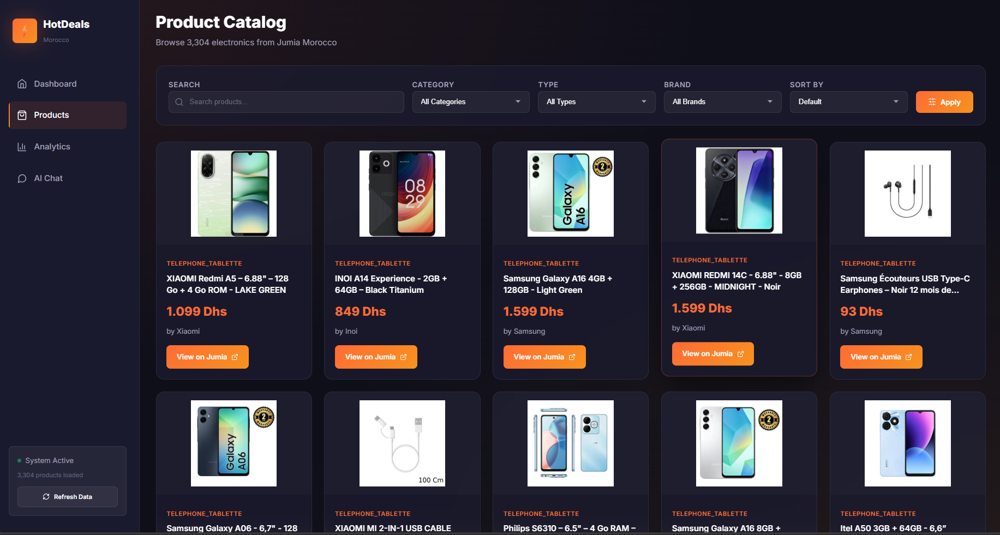
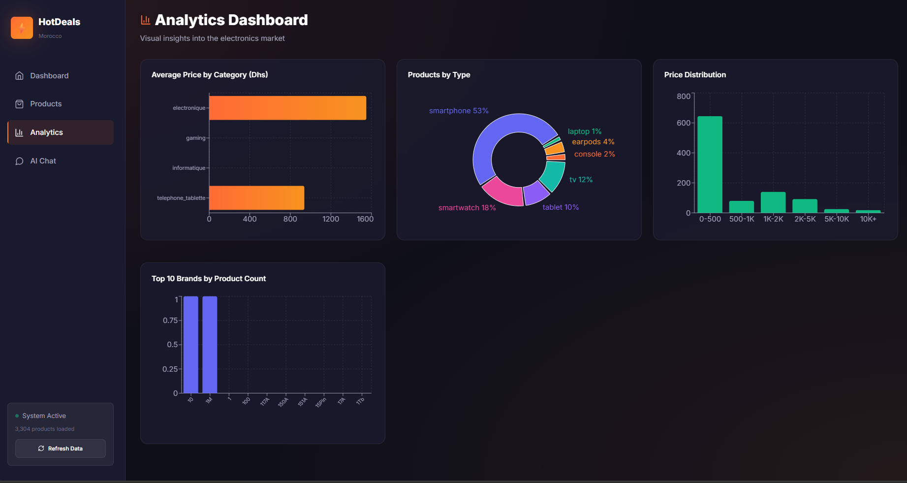
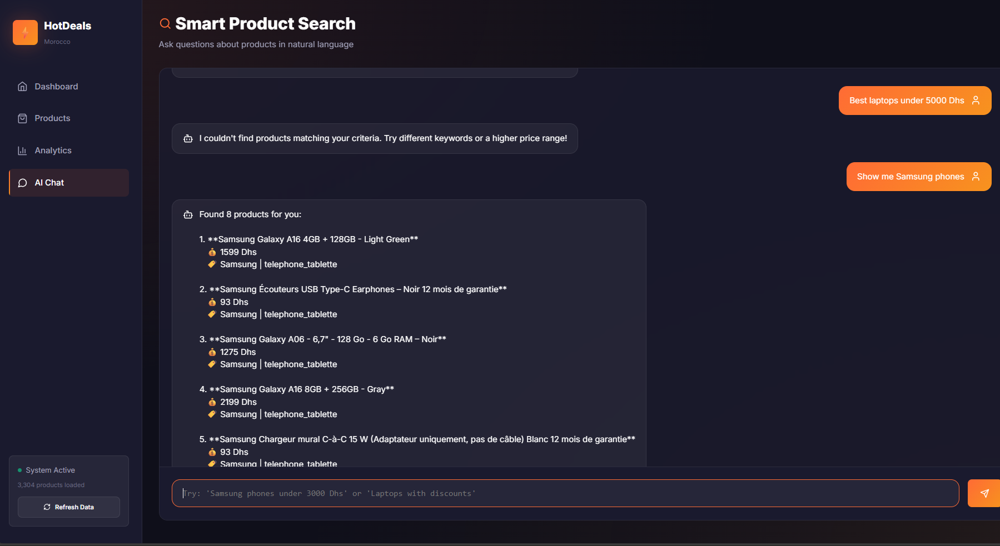

# 🛒 Electronics Hot Deals Morocco

<div align="center">


**A modern full-stack web application that aggregates and analyzes electronics deals from Moroccan e-commerce platforms.**

[Features](#-features) • [Tech Stack](#-tech-stack) • [Architecture](#-architecture) • [Installation](#-installation) • [Screenshots](#-screenshots)

</div>

---

## 🎯 Overview

Electronics Hot Deals is a comprehensive data pipeline and dashboard application designed to help users discover the best electronics deals in Morocco. It automatically scrapes, cleans, and visualizes product data from **Jumia** and **Electroplanet**, providing real-time insights through an elegant modern UI.

### Key Highlights

- 🔄 **Automated Data Pipeline** — Scheduled web scraping every 6 hours
- 📊 **Interactive Analytics** — Dynamic charts and visualizations with Recharts
- 🤖 **AI-Powered Search** — Natural language product queries via Google Gemini
- 🎨 **Modern UI/UX** — Dark theme with glassmorphism and smooth animations
- ⚡ **High Performance** — FastAPI backend with React + Vite frontend

---

## ✨ Features

| Feature | Description |
|---------|-------------|
| **Smart Deal Scoring** | Algorithm ranks products by discount %, price, and brand trust |
| **Advanced Filtering** | Filter by category, brand, product type, and price range |
| **Real-time Search** | Instant search across 3,000+ products |
| **Price Analytics** | Distribution charts, category comparisons, brand rankings |
| **AI Chatbot** | Ask questions like "Best TV under 5000 Dhs" |
| **Auto-refresh** | Background scheduler keeps data current |
| **Responsive Design** | Works seamlessly on desktop, tablet, and mobile |

---

## 🛠 Tech Stack

### Backend
| Technology | Purpose |
|------------|---------|
| **Python 3.10+** | Core language |
| **FastAPI** | High-performance REST API |
| **APScheduler** | Automated job scheduling |
| **Pandas** | Data manipulation & analysis |
| **BeautifulSoup** | HTML parsing for Jumia |
| **Playwright** | Browser automation for Electroplanet |
| **Pydantic** | Data validation |

### Frontend
| Technology | Purpose |
|------------|---------|
| **React 18** | UI component library |
| **Vite** | Next-gen build tool |
| **React Router** | Client-side routing |
| **Recharts** | Data visualization |
| **Lucide React** | Icon system |
| **CSS3** | Custom design system with CSS variables |

### APIs & Services
| Service | Purpose |
|---------|---------|
| **Google Gemini** | AI-powered product Q&A |

---

## 🏗 Architecture

```
┌─────────────────────────────────────────────────────────────┐
│                        FRONTEND                              │
│  ┌─────────┐  ┌──────────┐  ┌───────────┐  ┌─────────┐     │
│  │Dashboard│  │ Products │  │ Analytics │  │ AI Chat │     │
│  └────┬────┘  └────┬─────┘  └─────┬─────┘  └────┬────┘     │
│       └────────────┴──────────────┴─────────────┘          │
│                         React + Vite                        │
└─────────────────────────────┬───────────────────────────────┘
                              │ HTTP/REST
┌─────────────────────────────┴───────────────────────────────┐
│                        BACKEND                               │
│  ┌──────────────┐    ┌─────────────┐    ┌────────────────┐ │
│  │  FastAPI     │    │ APScheduler │    │  Data Layer    │ │
│  │  REST API    │◄───│  (6h cycle) │───►│  (Pandas/CSV)  │ │
│  └──────────────┘    └─────────────┘    └────────────────┘ │
└─────────────────────────────┬───────────────────────────────┘
                              │
┌─────────────────────────────┴───────────────────────────────┐
│                       SCRAPERS                               │
│  ┌─────────────────────┐    ┌──────────────────────────┐   │
│  │  Jumia Scraper      │    │  Electroplanet Scraper   │   │
│  │  (BeautifulSoup)    │    │  (Playwright)            │   │
│  └─────────────────────┘    └──────────────────────────┘   │
└─────────────────────────────────────────────────────────────┘
```

---

## 📁 Project Structure

```
ElectronicsHotDeals/
├── backend/
│   ├── main.py                 # FastAPI application entry
│   ├── scheduler.py            # APScheduler configuration
│   ├── models.py               # Pydantic schemas
│   └── routes/
│       └── products.py         # Product API endpoints
├── frontend/
│   ├── src/
│   │   ├── App.jsx             # Main app with routing
│   │   ├── components/
│   │   │   ├── Navbar.jsx      # Sidebar navigation
│   │   │   ├── ProductCard.jsx # Product display card
│   │   │   └── StatsCard.jsx   # Statistics card
│   │   ├── pages/
│   │   │   ├── Dashboard.jsx   # Home page with stats
│   │   │   ├── Products.jsx    # Filterable catalog
│   │   │   ├── Analytics.jsx   # Charts & graphs
│   │   │   └── Chat.jsx        # AI assistant
│   │   └── styles/
│   │       └── index.css       # Design system
│   ├── package.json
│   └── vite.config.js
├── scraper_jumia_electronics.py    # Jumia web scraper
├── scraper_electroplanet.py        # Electroplanet scraper
├── clean_jumia_data.py             # Data cleaning pipeline
└── requirements.txt
```

---

## 🚀 Installation

### Prerequisites

- Python 3.10 or higher
- Node.js 18 or higher
- npm or yarn

### Setup

1. **Clone the repository**
   ```bash
   git clone https://github.com/SalmaneSossey/ElectronicsHotDeals.git
   cd ElectronicsHotDeals
   ```

2. **Install Python dependencies**
   ```bash
   pip install -r requirements.txt
   pip install fastapi uvicorn apscheduler
   playwright install  # For Electroplanet scraper
   ```

3. **Install frontend dependencies**
   ```bash
   cd frontend
   npm install
   cd ..
   ```

4. **Run the scrapers (optional - sample data included)**
   ```bash
   python scraper_jumia_electronics.py
   python clean_jumia_data.py
   ```

5. **Start the backend**
   ```bash
   cd backend
   python main.py
   # API running at http://localhost:8000
   # Swagger docs at http://localhost:8000/docs
   ```

6. **Start the frontend** (in a new terminal)
   ```bash
   cd frontend
   npm run dev
   # Open http://localhost:5173
   ```

---

## 📸 Screenshots

### Dashboard
> Modern dark theme with stats overview and top deals



### Products Catalog
> Filterable grid with search, category, and brand filters



### Analytics Dashboard
> Interactive charts: price distribution, category analysis, brand rankings



### Smart Product Search
> Natural language product search with keyword matching



---

## 🔌 API Endpoints

| Method | Endpoint | Description |
|--------|----------|-------------|
| `GET` | `/api/products` | List products with pagination & filters |
| `GET` | `/api/products/stats` | Dashboard statistics |
| `GET` | `/api/products/top-deals` | Top deals by score |
| `POST` | `/api/scrape/trigger` | Manually trigger scraping |
| `GET` | `/api/scrape/status` | Current scrape status |

### Example Request
```bash
curl "http://localhost:8000/api/products?category=electronique&per_page=10"
```

---

## 🎨 Design Philosophy

The UI follows modern design principles:

- **Dark Theme** — Reduces eye strain, looks professional
- **Glassmorphism** — Subtle transparency and blur effects
- **Gradient Accents** — Orange-to-yellow gradients for CTAs
- **Micro-animations** — Smooth hover effects and transitions
- **Responsive** — Mobile-first approach with breakpoints

---

## 🤝 Skills Demonstrated

This project showcases proficiency in:

- **Full-Stack Development** — React frontend + FastAPI backend
- **Web Scraping** — BeautifulSoup, Playwright, anti-detection
- **Data Engineering** — ETL pipeline, data cleaning, analysis
- **API Design** — RESTful endpoints, Pydantic validation
- **Modern UI/UX** — CSS design systems, responsive layouts
- **DevOps** — Background scheduling, process management
- **AI Integration** — LLM API integration (Gemini)

---

## 📄 License

This project is open-source and available under the MIT License.

---

## 👤 Author

**Salmane Sossey**  
AI & Data Engineering Student @ ENSIAS

[](https://github.com/SalmaneSossey)
[](https://linkedin.com/in/salmane-sossey)

---

<div align="center">
⭐ Star this repo if you found it helpful!
</div>
